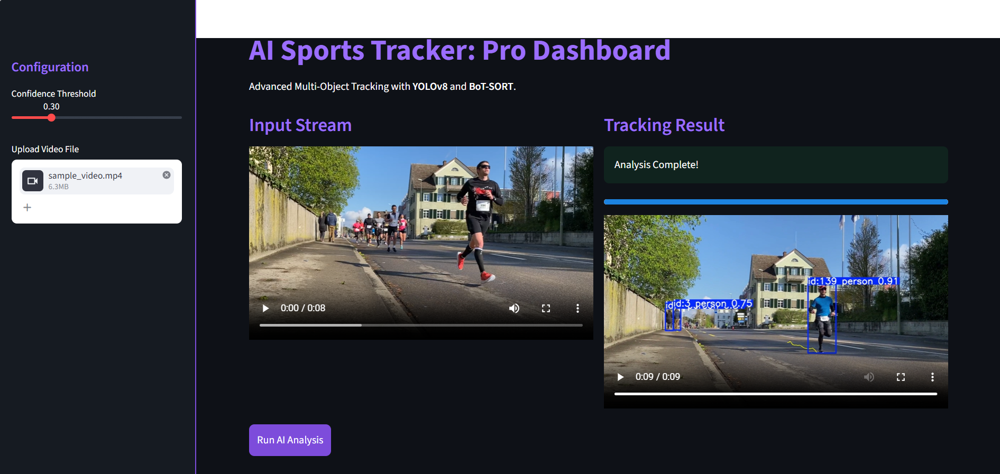

# Multi-Object Detection and Persistent ID Tracking in Sports Footage



## Project Overview
This project implements a robust computer vision pipeline designed to detect and track multiple subjects in high-motion sports environments. Using state-of-the-art Deep Learning models, the system assigns unique, persistent IDs to athletes and visualizes their movement trajectories over time. The solution is optimized for real-world challenges such as partial occlusion, rapid motion, and camera panning.

## Key Features
*   **Object Detection:** Utilizes **YOLOv8m** (Medium) for high-precision detection of players and participants.
*   **Persistent Tracking:** Implements **BoT-SORT** (ByteTrack with Camera Motion Compensation) to maintain subject IDs even during camera movement and zooms.
*   **Trajectory Visualization:** Draws historical movement paths (tails) for each subject to analyze movement patterns.
*   **Occlusion Handling:** Employs **Kalman Filters** to predict subject positions during overlaps or temporary disappearances.
*   **Interactive UI:** A custom-built **Streamlit dashboard** with a professional dark-purple aesthetic for interactive file processing.

## Technical Stack
*   **Language:** Python 3.12
*   **Inference:** Ultralytics (YOLOv8)
*   **Vision Processing:** OpenCV, NumPy
*   **Tracking Algorithms:** BoT-SORT / ByteTrack
*   **Infrastructure:** Developed and tested on **Antigravity.ai** (Cloud GPU Environment)

## Repository Structure
```text
sports-tracking-ai/
├── assets/              # UI Screenshots and Media
├── src/
│   ├── __init__.py
│   ├── tracker.py       # Core tracking and trajectory logic
│   └── utils.py         # Video I/O and property helpers
├── data/
│   ├── input/           # Source video files
│   └── output/          # Processed videos with annotations
├── main.py              # Main execution script
├── app.py               # Streamlit Web UI
├── requirements.txt     # Environment dependencies
└── README.md            # Project documentation Installation & Usage
1. Clone the Repository
git clone [https://github.com/Vanshikap18/sports-tracking-ai.git](https://github.com/Vanshikap18/sports-tracking-ai.git)
cd sports-tracking-ai

2. Install Dependencies
pip install -r requirements.txt

3. Run the Pipeline
Place your source video in data/input/sample_video.mp4, then run the CLI:
python main.py

Or launch the Web Dashboard:
streamlit run app.py

Demo & Data Source
Input Source: https://www.pexels.com/video/people-running-during-race-11769129/

Output Preview: Processed result available in data/output/annotated_result.mp4.

Model Selection & Reasoning
Detector (YOLOv8m): Chosen for its optimal trade-off between inference speed and detection mAP. It reliably detects subjects in the distance and under motion blur.

Tracker (BoT-SORT): Selected specifically for sports footage. Unlike standard trackers, BoT-SORT incorporates Camera Motion Compensation (CMC). This ensures that when the camera pans, the tracker distinguishes between player movement and background movement, reducing ID switches.

Observations & Limitations
conclusion : The system successfully maintains IDs when players cross paths, thanks to Re-ID features and Kalman Filter prediction.

Motion Blur: Extremely fast movements may cause momentary ID flickering; this is mitigated by a confidence threshold of 0.3.